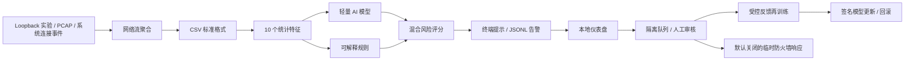

# AI Firewall（AI 防火墙）

[](https://github.com/heartofiron-dev/ai-firewall/actions/workflows/tests.yml)

一个在本机运行的、以隐私优先为原则的 AI 网络入侵检测原型。项目把可解释的安全规则与轻量统计模型结合，对网络流元数据进行风险评分，并输出结构化告警。

> **当前定位：检测、审核与受控响应平台，不是生产级防火墙。** v1.1 默认仍只分析和告警；Windows 防火墙命令默认只生成计划，必须人工复核并显式输入二次确认才会执行。仓库从不自动抓包、自动训练或自动封禁。

## 已经完成了什么

- 建立了从 CSV 网络流记录到风险告警的完整 MVP 流程。
- 实现 10 个基础流量特征，包括连接频率、失败次数、端口数量、SYN/RST 比例与传输字节数。
- 实现端口扫描、认证爆破、连接洪泛、异常数据突增、可疑端口 5 类可解释规则。
- 内置一个轻量线性风险模型，并使用“70% 模型 + 30% 规则、强规则保底”的混合打分方式。
- 实现不依赖第三方机器学习包的逻辑回归训练器，可使用自己的带标签 CSV 重新训练。
- 实现 precision、recall、false positive rate 等评估指标。
- 提供安全的模拟数据、自动化测试和 GitHub Actions 持续集成。
- 提供强制锁定 `127.0.0.1` 的本机 Socket 实验：只连接程序自己占用的端口，真实产生有上限的正常访问、扫描形态、虚拟认证拒绝、连接突增、数据突增和可疑端口行为。
- 所有分析默认在本机完成，不上传网络记录。
- 支持直接读取 classic PCAP，将 Ethernet、RAW 或 Linux SLL 中的 IPv4/IPv6 TCP/UDP 包聚合成网络流。
- 支持 Windows 实时 TCP 连接监控，展示进程、PID、连接方向、状态、风险和告警原因。
- 支持 PCAPNG Section、Interface 与 Enhanced Packet Block，可读取多接口及各自时间分辨率。
- 默认把正反方向数据包合并为一条双向流，分别统计 `bytes_sent` 与 `bytes_received`。
- 支持使用 Windows 自带 `pktmon` 进行 1～3600 秒的限时包级采集，并转换为本地 PCAPNG。
- 支持按时间切分校准集与独立测试集，校准目标误报率，并输出逐日误报基线报告。
- 支持安全遍历常见 IPv6 扩展头，并对扩展头数量、累计长度、分片和畸形包执行严格边界检查。
- 提供 CICIDS2017 与 UNSW-NB15 的独立 CSV 适配器，统一字段、时间单位、标签和 60 秒上下文。
- 支持在完全相同的时间切分、特征和误报目标下，对比逻辑回归、Isolation Forest 与 LightGBM。
- 每条告警同时输出结构化规则证据、线性模型前三项特征贡献、算法和模型版本。
- 提供只绑定本机的零依赖仪表盘，可自动刷新连接/告警、筛选记录并标记待审核误报。
- 实现隔离反馈闭环：短指纹进入待审核队列，人工批准后只提取数值特征，再与授权基线数据受限合并训练；拒绝反馈和未审核反馈永不进入模型。
- 提供默认 dry-run 的 Windows 防火墙集成，内置允许名单、60 秒至 24 小时临时规则、到期清理、托管规则回滚和 kill switch。
- 提供 Ed25519 模型更新包、固定版本验证、SHA-256 完整性检查、原子安装和失败/手工回滚。
- 提供可复现的 CPU、Python 内存、吞吐与 p50/p95/p99 延迟报告，以及带授权/脱敏声明的真实环境发布门槛审核。

## 系统如何工作



当前仓库已经实现图中的全部软件链路。真实环境发布结论仍必须由使用者在获得授权、完成脱敏的跨日独立数据上运行 `benchmark` 与 `baseline-gate`；演示数据不能替代这项外部验收。

## 当前能识别的行为

| 行为 | 主要信号 | 规则编号 |
|---|---|---|
| 端口扫描 | 60 秒内访问大量不同端口 | `PORT_SCAN` |
| SSH/RDP 等爆破 | 认证端口连续连接失败 | `BRUTE_FORCE` |
| SYN/连接洪泛 | 短时间大量连接或 SYN | `CONNECTION_FLOOD` |
| 异常数据传输 | 短时间传输超过基线的数据 | `DATA_SPIKE` |
| 可疑端口通信 | 常见后门/恶意工具端口 | `SUSPICIOUS_PORT` |
| 未知统计异常 | 模型判断特征偏离正常模式 | 模型告警 |

## 快速开始

要求：Python 3.10 或更高版本。运行核心功能不需要下载第三方依赖。

```bash
git clone https://github.com/heartofiron-dev/ai-firewall.git
cd ai-firewall
python -m venv .venv
```

Windows PowerShell：

```powershell
.venv\Scripts\Activate.ps1
python -m pip install -e .
ai-firewall demo
```

macOS / Linux：

```bash
source .venv/bin/activate
python -m pip install -e .
ai-firewall demo
```

演示会分析 2 条正常样本和 4 条攻击模拟样本。它只读取仓库内的 CSV，不发送攻击流量，也不会修改系统配置。

## 本机 Loopback 安全实验

v1.1 可以在当前电脑上产生真实的 TCP Socket 行为，而不是直接读取预先写好的模拟 CSV。命令没有目标地址参数，只允许连接 `127.0.0.1`，并且每个目标端口必须先由实验程序自己成功绑定；因此不会扫描局域网、公网或碰触本机已有服务。

运行全部场景需要显式确认：

```powershell
ai-firewall lab-simulate --confirm LOCAL-LAB --output lab-report.json
```

也可以只运行一个场景：

```powershell
ai-firewall lab-simulate --scenario port-scan --confirm LOCAL-LAB
```

| 场景 | 实际本机行为 | 期望结果 |
|---|---|---|
| `normal` | 访问程序自己的临时 HTTP 服务一次 | 不告警 |
| `port-scan` | 依次连接程序自己占用的 20 个临时端口 | `PORT_SCAN` |
| `brute-force` | 虚拟认证服务拒绝 12 次固定测试令牌 | `BRUTE_FORCE` |
| `connection-flood` | 向一个临时服务建立 220 个有上限的短连接 | `CONNECTION_FLOOD` |
| `data-spike` | 向临时接收器传输 50.5 MB 内存生成数据 | `DATA_SPIKE` |
| `suspicious-port` | 连接程序自己占用的 4444/5555/6667/31337 之一 | `SUSPICIOUS_PORT` |

实验具有以下不可绕过的边界：

- 必须输入准确确认词 `LOCAL-LAB`，否则在创建任何 Socket 前退出；
- 不接受 IP、主机名、端口列表或流量规模参数；
- 只使用 IPv4 loopback `127.0.0.1`，不访问局域网或互联网；
- 只连接程序自己成功占用的监听端口；端口被其他程序使用时不会连接它；
- 不使用系统账户、真实密码、漏洞利用、恶意软件、原始套接字或管理员权限；
- 不启动 `pktmon`、不保存 PCAP、不读取其他进程连接，也不修改 Windows 防火墙；
- 数据突增使用重复内存字节，不读取磁盘文件；全部场景都有固定数量和 Socket 超时；
- `lab-report.json` 只包含 loopback 实验元数据和检测结果，已被 `.gitignore` 排除。

这个实验可以验证本机 Socket 行为、特征、模型、规则和告警闭环，但包数量是按 Socket 操作/字节数估算的，不验证 `pktmon` 或物理网卡抓包。它也不能替代获授权、脱敏、跨日的真实正常流量误报基线。

项目所有者电脑上的一次脱敏实测结果见 [`docs/loopback-lab-results-v1.1.0.md`](docs/loopback-lab-results-v1.1.0.md)。原始本地报告仍被 `.gitignore` 排除。

## 功能使用方法

### 0. 从 PCAP 转换并检测

只做格式转换：

```bash
ai-firewall pcap capture.pcapng --output flows.csv
```

转换后立即检测并输出告警：

```bash
ai-firewall pcap capture.pcapng --output flows.csv --analyze --alerts pcap-alerts.jsonl
```

当前转换器具有以下边界：

- 自动识别 classic PCAP 与 PCAPNG；
- PCAPNG 支持多个 Section、Interface、Enhanced Packet Block 和接口时间分辨率；
- 支持 Ethernet、RAW IP、Linux cooked capture v1；
- 支持 IPv4 TCP/UDP，以及带 Hop-by-Hop、Routing、Destination、Fragment、AH、Mobility 常见扩展头的 IPv6 TCP/UDP；
- IPv6 扩展头最多遍历 8 个、累计 2048 字节；非首片分片、ESP、无下一头、异常顺序和畸形长度会被安全跳过；
- 只使用包头和长度，不保存应用层载荷；
- 默认按双向五元组聚合，以捕获到的第一个包作为发起方向并分别统计上下行字节；
- 如需保留原始方向性流，可添加 `--directional`。

只应分析你有权查看的抓包文件。真实 PCAP 仍可能包含 IP、域名和其他敏感信息，禁止直接提交到公开仓库。

### 0.1 Windows 实时连接监控

监控 60 秒：

```powershell
ai-firewall monitor --duration 60 --output live-alerts.jsonl
```

只采集一次当前连接，适合快速验收：

```powershell
ai-firewall monitor --once --all --output current-connections.jsonl
```

持续运行直到按下 `Ctrl+C`：

```powershell
ai-firewall monitor --duration 0
```

实时监控优先通过 Windows 自带的 `Get-NetTCPConnection` 获取本机 TCP 元数据；如果当前会话无权调用它，会自动回退到只读的 `netstat -ano`。程序在系统允许时使用进程列表补充名称和 PID，通常不需要管理员权限。它只会把“本轮新出现”的连接计入按来源 IP、进程和方向隔离的 60 秒窗口，避免长连接重复计数，也避免不同桌面程序共同触发端口扫描误报。

连接表不包含完整包数和字节数，也可能错过非常短的连接，所以实时模式目前适合发现连接突增、可疑端口和进程外联，不应声称可以替代包级 IDS。需要包级分析时使用 PCAP 路线。

### 0.2 Windows 限时包级采集

在“以管理员身份运行”的 PowerShell 中执行：

```powershell
ai-firewall capture --duration 30 --output capture.pcapng
```

采集结束后立即聚合并检测：

```powershell
ai-firewall capture --duration 30 --output capture.pcapng --analyze
```

安全设计：

- 使用 Windows 自带 `pktmon`，不安装内核驱动或第三方抓包程序；
- 必须指定 1～3600 秒范围内的时长，默认 30 秒；
- 输出必须是 `.pcapng`，已存在的文件默认拒绝覆盖；
- 只有显式添加 `--overwrite` 才允许覆盖同名输出；
- 中断时仍会停止本次采集，并清理中间 ETL 文件；
- 数据只保存在指定本地路径，不会被程序上传。

PCAPNG 可能包含敏感 IP、DNS 和未加密应用数据。只在获授权的设备和网络上使用，采集后按敏感数据管理，不要提交到公开 GitHub 仓库。

### 0.3 转换 CICIDS2017 / UNSW-NB15

本项目不自动下载公开数据集。请先确认数据集许可，并从官方来源取得 CSV：

- [CICIDS2017（University of New Brunswick）](https://www.unb.ca/cic/datasets/ids-2017.html)
- [UNSW-NB15（UNSW Canberra）](https://research.unsw.edu.au/projects/unsw-nb15-dataset)

转换 CICIDS2017 的 CICFlowMeter CSV：

```bash
ai-firewall convert-dataset cicids2017 CICIDS2017.csv \
  --timestamp-format "%m/%d/%Y %H:%M:%S" \
  --output cicids-flows.csv
```

转换 UNSW-NB15 官方 49 字段原始流 CSV（支持官方无表头文件，也支持同字段带表头文件）：

```bash
ai-firewall convert-dataset unsw-nb15 UNSW-NB15.csv --output unsw-flows.csv
```

先安全试跑前 1000 行：

```bash
ai-firewall convert-dataset cicids2017 CICIDS2017.csv \
  --max-rows 1000 --output preview.csv
```

转换规则与边界：

- CICIDS2017 的 `Flow Duration` 从微秒转换为毫秒，正反向包数与字节数映射到统一 schema；`BENIGN` 转为 `benign`，其他攻击名称转为 `attack`。
- CICIDS 的斜线日期可能有月/日歧义。正式实验应显式传入 Python `strptime` 格式；未指定时优先按月/日解析。
- UNSW-NB15 的 `stime` 按 Unix 秒转换为 UTC ISO 8601，`dur` 从秒转换为毫秒，并支持十六进制端口。
- UNSW 官方 49 字段原始分片可直接转换；带表头版本必须提供 `srcip`、`dstip`、`sport`、`dsport`、`stime`。官方 training/testing 分区省略了端点和 `stime`，无法可靠生成本项目五元组与时间窗口，因此会被有意拒绝。
- 两个适配器都按来源 IP 计算当前记录在内的 60 秒连接数、目标端口数和失败连接数；输入必须在每个来源内按时间非递减排列，否则拒绝转换，防止上下文泄漏。
- 缺少必需字段、无效 IP/端口、负数、`NaN`、`Infinity` 会明确报错；UNSW 没有等价 TCP flag 计数时不伪造 SYN，只有明确 `RST` 状态计入 RST。
- 转换以流式方式运行，不把完整数据集载入内存；先写临时文件，成功后再替换目标。已有输出默认不会覆盖，只有显式添加 `--overwrite` 才会替换。
- 转换器只读取 CSV 元数据，不读取 PCAP、不发包、不扫描网络，也不会上传数据。不要把完整公开数据集、真实日志或包含个人网络标识的转换结果提交到本仓库。

公开数据集只能验证适配和模型研究流程，不能替代目标电脑上经过授权、匿名化且跨日的正常流量基线。

### 1. 分析网络流文件

```bash
ai-firewall analyze data/sample_flows.csv --output alerts.jsonl
```

默认只把超过阈值的结果写入 `alerts.jsonl`。需要保存全部结果时：

```bash
ai-firewall analyze data/sample_flows.csv --all --output all-results.jsonl
```

可以调节告警阈值（数值越低越敏感，误报也可能越多）：

```bash
ai-firewall analyze data/sample_flows.csv --threshold 0.70
```

终端中的每条告警会额外显示 `model=算法@版本`、风险贡献绝对值最大的三个特征，以及命中的规则和规则分数。JSONL 保留原有字段，并新增：

| 字段 | 含义 |
|---|---|
| `rule_evidence` | 每条命中规则的 `rule_id`、分数和文字证据 |
| `top_features` | 特征原值、标准化值、权重、logit 贡献与风险方向 |
| `model_algorithm` | 模型元数据中的算法名 |
| `model_version` | 模型声明的版本；旧模型未声明时使用稳定的内容 SHA-256 短指纹 |
| `feature_snapshot` | 10 个纯数值特征；只用于把经人工批准的反馈接入受控再训练，不含 IP/进程/时间 |

`top_features` 是线性模型对本次评分的精确数学拆解，正贡献表示推高模型风险，负贡献表示降低模型风险。它用于审查模型判断，不代表因果关系，也不能单独证明攻击成立。

### 2. 训练自己的模型

训练 CSV 必须包含 `label` 列；正常样本可写 `benign` 或 `0`，攻击样本可写 `attack` 或 `1`。

```bash
ai-firewall train data/sample_flows.csv --output models/trained-model.json
```

使用新模型分析：

```bash
ai-firewall analyze data/sample_flows.csv --model models/trained-model.json
```

默认训练器仍是标准化后的二分类逻辑回归，使用随机梯度下降。它的优点是部署小、核心安装零依赖、输出稳定且容易解释。v0.7 起提供的可选对比工具会训练 Isolation Forest 与 LightGBM 用于研究评估，但不会自动替换默认模型，更不会因为某次小样本排名而启用拦截。

### 3. 评估检测效果

```bash
ai-firewall evaluate data/sample_flows.csv --model models/baseline.json
```

评估会输出：

- `precision`：告警中真正是攻击的比例；
- `recall`：真实攻击中被发现的比例；
- `false_positive_rate`：正常流量被误报的比例；
- TP、FP、TN、FN 混淆矩阵计数。

示例数据只用于验证程序流程，不能证明模型在真实网络上的效果。正式结论必须使用独立测试集，并按设备、网络环境和时间进行划分，避免数据泄漏。

### 4. 建立误报基线

对一份按时间持续收集、已经完成脱敏和标签审核的 CSV 运行：

```bash
ai-firewall benchmark labeled-flows.csv \
  --calibration-fraction 0.4 \
  --target-fpr 0.01 \
  --output benchmark-report.json
```

该命令不会随机打乱数据。最早的 40% 记录只用于选择满足目标 FPR 的阈值，后续 60% 作为独立测试时间段，报告：

- 校准阈值及目标是否达到；
- 独立测试集 Precision、Recall、FPR 与混淆矩阵；
- 平均每日误报数量；
- 每个 UTC 日期的正常/攻击样本数、误报数和当日 FPR；
- 数据过少或目标无法满足时的明确警告。

至少需要 8 条记录；校准期必须包含正常样本，独立测试期必须同时包含正常和攻击样本。少于 1000 条测试记录或 1000 条正常测试记录时，报告会标记置信度不足。建议真实发布门槛至少使用跨多个工作日、从未参与训练的数据。

不要使用 `data/sample_flows.csv` 宣称真实性能：它是程序演示集，规模不足，`benchmark` 会拒绝它。

### 5. 在相同时间切分下对比模型

模型对比是可选研究功能。先安装额外依赖：

```bash
python -m pip install -e ".[comparison]"
```

依赖组使用 [scikit-learn IsolationForest](https://scikit-learn.org/stable/modules/generated/sklearn.ensemble.IsolationForest.html) 与 [LightGBM LGBMClassifier](https://lightgbm.readthedocs.io/en/stable/pythonapi/lightgbm.LGBMClassifier.html)。核心的检测、PCAP 转换和 Windows 监控仍不需要它们。

执行对比：

```bash
ai-firewall compare-models labeled-flows.csv \
  --train-fraction 0.5 \
  --calibration-fraction 0.2 \
  --target-fpr 0.01 \
  --seed 42 \
  --output model-comparison.json
```

为了避免数据泄漏，该命令不会随机打乱数据：

- 最早 50% 是共享训练段；内置逻辑回归和 LightGBM 使用其标签训练，Isolation Forest 只学习其中的正常样本。
- 接下来 20% 是共享阈值校准段；每个模型只用该段的正常样本选择满足目标 FPR 的独立阈值。
- 最后 30% 是所有模型完全相同的独立测试段，只在这里计算 Precision、Recall、FPR、TP、FP、TN、FN。
- 三个模型使用同一组 10 个特征和固定随机种子，并将线程数固定为 1；报告记录依赖版本、切分边界、训练/评分耗时和完整阈值。
- 报告的排名先按测试 FPR、再按 Recall 和 Precision 排序，只是阅读辅助，不是自动选型或上线依据。

至少需要 20 条记录，三个时间段必须满足各自的标签要求。少于 1000 条独立测试记录会产生置信度警告；`data/sample_flows.csv` 会因过小而被拒绝。输出文件默认不覆盖，且绝不允许与输入 CSV 相同。

### 6. 启动本地仪表盘

先生成一份安全演示告警，再启动界面：

```bash
ai-firewall analyze data/sample_flows.csv --output alerts.jsonl
ai-firewall dashboard --input alerts.jsonl
```

浏览器打开 `http://127.0.0.1:8765`。页面每 2 秒重新读取 JSONL，可以按严重级别或关键词筛选，并显示时间、端点、进程、连接方向、风险与证据。

配合 Windows 实时连接监控时，在两个终端分别运行：

```powershell
ai-firewall monitor --duration 0 --all --output live-alerts.jsonl
ai-firewall dashboard --input live-alerts.jsonl --feedback feedback/pending.jsonl
```

仪表盘本身不会启动 `monitor` 或抓包。点击“标记误报”只会把告警内容短指纹、人工标签、备注和待审核状态写入独立 JSONL；不会复制 IP/进程详情，不会自动训练，也不会改变当前模型或 Windows 防火墙。输入尚未创建时界面会安全等待，监控写到一半的最后一行会暂时跳过。

安全约束包括：固定绑定 `127.0.0.1`、拒绝非本机 `Host`、写操作要求随机会话令牌、严格 CSP/同源响应头、输入与反馈文件分离、拒绝符号链接，并对请求体和文件大小设置上限。端口可用 `--port` 调整，单页最多显示数量可用 `--max-alerts` 调整。

### 7. 审核反馈并受控再训练

v1.0 的新告警包含完整的 10 维数值 `feature_snapshot`。仪表盘仍只把告警短指纹写入 `feedback/pending.jsonl`；审核命令使用短指纹回到原告警文件取数值特征，不把 IP、端口、进程名或时间写入训练账本。

先逐条批准或拒绝；也可以用 `--all` 处理当前全部待办：

```bash
ai-firewall review-feedback \
  --alerts alerts.jsonl \
  --pending feedback/pending.jsonl \
  --reviewed feedback/reviewed.jsonl \
  --decision approve \
  --alert-id 0123456789abcdef \
  --reviewer local-user
```

只有 `decision=approve` 且原反馈为 `false_positive` 的记录会得到 `training_label=0` 和特征快照。审核是追加、幂等的；同一短指纹不会重复写入。旧版告警没有完整特征快照时会拒绝批准，不能猜测或补造训练特征。

再以一份已授权、带标签且同时包含正常/攻击样本的基础 CSV 重新训练：

```bash
ai-firewall retrain-feedback authorized-base.csv \
  --reviewed feedback/reviewed.jsonl \
  --output models/feedback-model.json
```

默认最多允许已批准反馈占基础集的 20%，避免少量恶意或错误反馈主导模型；可降低 `--max-feedback-fraction`，但最高不能超过 50%。命令记录审核账本 SHA-256、批准数量和策略，不会自动替换当前模型。训练后仍应执行时间独立评估与签名发布。

### 8. Windows 防火墙受控响应

先生成计划；下面的默认命令不会修改系统：

```powershell
ai-firewall firewall-block 8.8.8.8 --duration 600
```

保护规则：只接受单个有效 IP；默认允许名单保护 loopback、链路本地、RFC1918 私网和 IPv6 ULA；自定义 CIDR 可放入文本文件并用 `--allowlist` 加载；时长只能是 60～86400 秒。实际执行需要管理员权限和两层显式开关：

```powershell
# 仅在你拥有或获准管理的 Windows 设备上执行
ai-firewall firewall-block 8.8.8.8 --duration 600 --apply --confirm APPLY
```

到期规则不会依赖常驻高权限服务，需由管理员按自己的变更流程定期运行清理；回滚只删除 `AI-Firewall-*` 托管规则：

```powershell
ai-firewall firewall-cleanup --apply --confirm CLEANUP
ai-firewall firewall-rollback --apply --confirm ROLLBACK
```

紧急关闭会先写入本地 marker，后续封禁立即失败；可选择同时回滚：

```powershell
ai-firewall firewall-kill-switch --rollback --confirm ROLLBACK
ai-firewall firewall-enable --confirm ENABLE
```

规则状态只保存在本机 `state/firewall-rules.json`。本项目不会根据模型分数自动调用以上执行命令，也没有在本次发布中对真实 Windows 防火墙做改动。

### 9. 模型签名、固定版本更新与回滚

签名工具需要可选依赖：

```bash
python -m pip install -e ".[updates]"
```

生成 Ed25519 密钥；私钥必须离线保管，`*.pem` 已被 `.gitignore` 排除，绝不能提交：

```bash
ai-firewall generate-signing-key --private-key keys/model-private.pem --public-key keys/model-public.pem
ai-firewall sign-model models/trained-model.json \
  --private-key keys/model-private.pem --version 1.0.0 \
  --output releases/model-1.0.0.aifw
```

安装时必须固定预期版本。程序只接受恰好三个成员的 `.aifw` 包，先验证 Ed25519、规范 manifest、模型 SHA-256、大小、特征兼容性和版本，再原子替换目标并保留 `.rollback`：

```bash
ai-firewall install-model-update releases/model-1.0.0.aifw \
  --public-key keys/model-public.pem \
  --expected-version 1.0.0 \
  --target models/active.json

ai-firewall rollback-model --target models/active.json
```

签名或校验失败不会改动目标；替换后的模型若无法重新加载，会自动恢复备份。模型更新只更新本地模型文件，不启动监控、采集或封禁。

### 10. 性能测试

在目标电脑上用固定输入、迭代次数和门槛生成 JSON 报告：

```bash
ai-firewall performance-test data/sample_flows.csv \
  --iterations 500 --warmup 20 \
  --max-p95-ms 5 --max-peak-mib 128 \
  --output performance-report.json
```

报告包含 Python/系统架构（不含主机名）、模型与阈值、处理量、单核 CPU 时间比例、吞吐量、p50/p95/p99/最大延迟和 `tracemalloc` Python 峰值内存。`passed=false` 时命令返回非零退出码，适合 CI 或目标设备验收。`tracemalloc` 不等于整个进程 RSS，因此生产容量规划还应配合操作系统级测量。

### 11. 真实环境发布门槛

先在获授权、脱敏、跨日数据上运行 `benchmark`。再准备一个不含流量内容的来源声明 JSON，至少包含：

```json
{
  "environment_id": "authorized-lab-a",
  "authorization_scope": "owner-approved endpoint metadata",
  "collection_period": "three or more independent days",
  "labeling_method": "manual review plus controlled replay",
  "authorization_confirmed": true,
  "anonymization_confirmed": true,
  "private_payloads_excluded": true,
  "independent_holdout_confirmed": true
}
```

执行硬门槛审核：

```bash
ai-firewall baseline-gate benchmark-report.json provenance.json \
  --min-days 3 --min-benign-rows 1000 \
  --max-fpr 0.01 --max-false-positives-per-day 10 \
  --min-recall 0.80 --output baseline-gate-report.json
```

缺少任一授权/脱敏/独立留出声明或指标不达标时返回非零退出码。仓库没有真实私密数据，因此 v1.0 只完成验收工具，不能声称真实环境门槛已经通过。

## CSV 数据格式

| 字段 | 类型 | 含义 |
|---|---:|---|
| `timestamp` | string | ISO 8601 时间 |
| `src_ip`, `dst_ip` | string | 源与目标 IP |
| `src_port`, `dst_port` | int | 源与目标端口 |
| `protocol` | string | TCP / UDP 等 |
| `duration_ms` | number | 连接时长（毫秒） |
| `packets` | int | 数据包总数 |
| `bytes_sent`, `bytes_received` | int | 上下行字节数 |
| `syn_count`, `rst_count` | int | TCP SYN / RST 数量 |
| `unique_dst_ports_60s` | int | 同一来源 60 秒内访问的不同目标端口数 |
| `connections_60s` | int | 同一来源 60 秒内连接数 |
| `failed_connections_60s` | int | 同一来源 60 秒内失败连接数 |
| `label` | string | 可选；训练/评估时必需 |

本项目只需要连接元数据，不需要读取 HTTPS 内容。实际采集时仍应移除或哈希不必要的标识符，并遵守所在地法律、组织政策和用户授权范围。

## 怎么测试

### 一键运行全部自动化测试

包含真实 Isolation Forest / LightGBM 和 Ed25519 更新集成测试时，安装两个可选依赖组：

```bash
python -m pip install -e ".[comparison,updates]"
python -m unittest discover -s tests -v
```

当前测试覆盖：

- 正常 HTTPS 与 DNS 样本不告警；
- 端口扫描能告警并返回对应解释；
- SSH/RDP 爆破能被识别；
- 连接洪泛会得到最高严重级别；
- 异常大流量与可疑端口能同时留下证据；
- 单独命中可疑端口时，规则保底分数也能越过默认告警阈值；
- 本机实验没有确认词时不会创建 Socket，拒绝非 loopback 地址和未由程序占用的端口；实际正常 HTTP loopback 场景可以完成收发；
- 训练结果能保存、重新加载并给出 0～1 概率。
- 合成 classic PCAP 能正确解析 TCP 五元组并计算 60 秒上下文；损坏文件会被拒绝。
- Windows PowerShell JSON 能转换为连接对象，入站/出站方向推断和长连接去重有效。
- PCAPNG 的 Section、Interface、微秒时间分辨率与 Enhanced Packet Block 能正确解析。
- TCP 正反方向数据包能合并，并分别累计上下行字节；`--directional` 仍可保留两条流。
- Windows 包级采集会拒绝无限时长、错误扩展名和意外覆盖，并生成明确的 `pktmon` 命令。
- 误报基线会按时间切分，输出逐日 FPR，并拒绝过小或类别缺失的独立测试区间。
- IPv6 常见扩展头链和首片分片可正确定位 TCP/UDP；非首片、ESP、无下一头、截断与超深链会被安全跳过。
- CICIDS2017 与 UNSW-NB15 合成字段能转换并重新读取；单位、标签、十六进制端口和 60 秒上下文正确，缺字段、非有限数值和时间倒退会被拒绝。
- 三模型共享同一训练/校准/测试时间边界和测试行数；真实 scikit-learn、LightGBM 适配器会完成训练、阈值校准和独立测试指标输出。
- 规则证据与旧 `rule_ids` 一致；前三项模型贡献按绝对值排序，显式版本和旧模型内容指纹均可追踪。
- 本地仪表盘会正确筛选可见字段、容忍尚未写完的 JSONL 行，拒绝恶意 Host/无令牌写入，并把误报幂等写入隔离审核队列。
- 反馈只有经过显式批准、能与原告警短指纹匹配且具有完整数值快照时才能参与训练；账本去重、反馈比例上限和来源哈希有效。
- 防火墙默认只生成计划，保护默认允许名单，执行/回滚/到期清理均要求不同确认词，kill switch 会阻止新规则。
- Ed25519 更新包会拒绝错误固定版本、篡改模型、额外成员和无效签名；安装保留可验证回滚副本。
- 性能报告包含 CPU/内存/吞吐和延迟分位数；真实基线门槛会同时核验指标与授权、脱敏、独立留出声明。

### 手工验收清单

1. 执行 `ai-firewall demo`，应看到 6 条分析结果，其中 2 条为 `OK`、4 条为 `ALERT`。
2. 执行 `ai-firewall analyze data/sample_flows.csv`，确认生成 `alerts.jsonl`。
3. 检查每条告警是否有 `risk_score`、`severity`、`reasons`、`rule_evidence`、`top_features` 和 `model_version`。
4. 执行训练命令，确认新模型 JSON 中包含训练时间、样本数和算法信息。
5. 执行评估命令，确认 precision、recall 与误报率均有输出。
6. 向 CSV 删除一个必需字段，程序应清楚提示缺少字段，而不是静默跳过。
7. 执行 `ai-firewall dashboard --input alerts.jsonl`，确认页面能筛选告警；标记误报后只新增本地 `feedback/pending.jsonl`，模型和防火墙均不变化。
8. 对一个短指纹分别执行 `review-feedback` 和 `retrain-feedback`，确认审核账本没有 IP/进程，模型元数据包含账本 SHA-256，且旧模型未被自动替换。
9. 执行 `ai-firewall firewall-block 8.8.8.8 --duration 600`，确认输出 `dry_run: true`；不要在日常电脑上添加 `--apply` 做演示。
10. 在临时目录生成签名密钥和 `.aifw`，验证正确固定版本可以安装、错误版本失败，并删除临时私钥。
11. 执行 `performance-test`，确认生成报告且门槛决定退出码；只用合成报告测试 `baseline-gate` 的程序分支，不能把它当作真实验证。
12. 执行 `lab-simulate --confirm LOCAL-LAB`，确认六个场景均为 `PASSED`；检查报告声明 `packet_capture=false`、`firewall_changes=false`，不要把它解释为跨日误报基线。

### 真实环境测试原则

- 先用自己有权限的实验网络或虚拟机；不要扫描公共 IP 或未经授权的设备。
- 第一轮保持“只告警”，至少收集一至两周正常基线。
- 将训练集、验证集、测试集按时间分割；同一会话不能跨集合。
- 逐类记录漏报，尤其是低速扫描、慢速爆破与加密恶意通信。
- 把每日误报数量作为发布门槛，而不只看总体 accuracy。
- 自动拦截功能上线前必须具备允许名单、超时解封、审计日志和紧急关闭开关。

## 项目结构

```text
ai-firewall/
├── data/sample_flows.csv       # 不会产生真实攻击的演示数据
├── models/baseline.json        # 开发用启动模型
├── src/ai_firewall/
│   ├── cli.py                  # 命令行入口与安全输出处理
│   ├── baseline_gate.py        # 真实数据来源声明与发布硬门槛
│   ├── benchmark.py            # 时间切分、阈值校准与逐日误报报告
│   ├── comparison.py           # 三模型共享时间切分与公平评估
│   ├── dashboard.py            # 回环地址仪表盘与隔离误报队列
│   ├── detector.py             # 混合评分与告警结果
│   ├── datasets.py             # CICIDS2017 / UNSW-NB15 安全转换器
│   ├── features.py             # 特征提取
│   ├── feedback.py             # 隔离审核账本与受控反馈再训练
│   ├── firewall.py             # 默认关闭的 Windows 临时规则与回滚
│   ├── io.py                   # CSV 与 JSONL 输入输出
│   ├── lab.py                  # 仅限 loopback 的实际 Socket 安全实验
│   ├── model.py                # 模型加载和推理
│   ├── pcap.py                 # 纯 Python classic PCAP 解析与流聚合
│   ├── performance.py          # CPU、内存、吞吐与延迟报告
│   ├── rules.py                # 可解释安全规则
│   ├── schema.py               # 网络流数据结构
│   ├── training.py             # 逻辑回归训练器
│   ├── updates.py              # Ed25519 签名更新、固定版本与回滚
│   ├── windows_capture.py      # pktmon 限时采集、ETL 转 PCAPNG
│   └── windows_monitor.py      # Windows 连接、进程和滚动窗口监控
├── tests/                      # 自动化测试
├── .github/workflows/tests.yml # GitHub Actions
├── SECURITY.md                 # 安全与漏洞报告说明
└── README.md
```

## 数据与模型计划

建议按下面的顺序引入数据，而不是直接混合所有公开数据集：

1. 使用 `sample_flows.csv` 验证代码、格式和测试闭环。
2. 使用已实现的 CICIDS2017 / UNSW-NB15 独立转换器统一字段；CSE-CIC-IDS2018 需先验证版本字段差异。
3. 在隔离实验室中生成少量、可复现且有明确授权的攻击样本。
4. 收集经过匿名化的真实正常流量，建立不同设备类型和使用时段的基线。
5. 保留从未参与训练的时间段与网络作为最终测试集。
6. 记录数据来源、许可、采集日期、标签方式、脱敏方式与已知偏差。

公开数据集的标签和流量分布可能与个人电脑差异很大，因此模型不能只在公开数据集上得到高分就直接用于拦截。

## 作业事项 / Roadmap

| 优先级 | 事项 | 验收标准 | 状态 |
|---|---|---|---|
| P0 | 完成离线检测闭环 | CSV → 特征 → 模型/规则 → JSONL 告警 | ✅ v0.1 |
| P0 | 建立自动化测试 | Python 3.10/3.12 在 GitHub Actions 通过 | ✅ v0.1 |
| P0 | 误报基线工具 | 时间切分、阈值校准、独立测试集每日误报与 FPR 报告 | ✅ v0.4 |
| P0 | 真实环境误报基线 | 在获授权且脱敏的跨日独立数据上达到发布门槛 | 🟡 v1.0 验收工具完成；待真实数据运行 |
| P1 | PCAP 转换器 | 可将授权的 classic PCAP 聚合成本项目 CSV，不保存载荷 | ✅ v0.2 |
| P1 | Windows 实时采集 | 低权限优先；展示进程、目的地和连接统计 | ✅ v0.2 基础版 |
| P1 | PCAPNG 与双向流 | 支持多接口 PCAPNG 与双向字节统计 | ✅ v0.3 |
| P1 | Windows 包级采集 | 使用 pktmon 限时采集、转 PCAPNG 并可直接检测 | ✅ v0.3 |
| P1 | IPv6 扩展头 | 安全遍历常见扩展头并限制解析深度 | ✅ v0.5 |
| P1 | 数据集转换器 | CICIDS、UNSW-NB15 分别有转换脚本与字段测试 | ✅ v0.6 |
| P1 | 本机 Loopback 实验 | 只连接自己占用的本机端口；六类有上限场景和报告完整 | ✅ v1.1 |
| P1 | 模型对比 | 逻辑回归、Isolation Forest、LightGBM 使用同一时间切分评估 | ✅ v0.7 |
| P1 | 可解释性 | 每条告警显示主要特征、规则证据和模型版本 | ✅ v0.8 |
| P2 | 本地界面 | 查看实时连接、筛选告警、标记误报 | ✅ v0.9 |
| P2 | 反馈学习 | 用户反馈进入隔离队列，经审核后再训练 | ✅ v1.0 |
| P2 | Windows 防火墙集成 | 默认关闭；允许名单、临时封禁、回滚和 kill switch 齐全 | ✅ v1.0（未在真实防火墙执行） |
| P2 | 模型签名与更新 | 更新包签名、版本固定、失败自动回滚 | ✅ v1.0 |
| P2 | 性能测试 | 目标设备 CPU/内存/延迟有可复现实验报告 | ✅ v1.0 工具与合成基线；目标设备应复测 |

### 每次发布前的维护事项

- 更新模型卡：训练数据、时间范围、指标、已知偏差、适用和禁用场景。
- 运行单元测试、演示、数据格式校验与独立测试集评估。
- 检查依赖漏洞、许可证与敏感信息；禁止提交真实个人网络日志。
- 抽查最高风险告警的解释；记录阈值变化及原因。
- 验证旧模型和旧 CSV 的兼容性，或提供明确迁移说明。
- 更新 README 的功能状态、测试结果和 Roadmap。

## 安全边界

- 本项目不包含漏洞利用代码，也不需要主动攻击其他设备。
- 仅在你拥有或明确获准测试的网络上采集与验证。
- `lab-simulate` 只用于当前电脑的 loopback 实验；不得修改代码解除 loopback、端口所有权、固定数量、超时或确认词限制后去测试其他目标。
- `baseline.json` 是开发启动模型，不代表已经过真实环境验证。
- 不要把密码、Cookie、API key、原始私密流量或个人身份信息提交到仓库。
- 不要提交完整公开数据集或其大规模派生文件；只提交许可清楚、不含个人信息的最小合成测试数据。
- 模型对比报告只反映给定时间切分；禁止把演示数据排名或单次高分解释为真实防护能力。
- 特征贡献只解释线性模型如何计算当前分数，不是攻击归因、因果证明或自动处置依据。
- 本地仪表盘只应在当前电脑上访问；不要用端口转发、反向代理或修改代码的方式把它暴露到局域网或互联网。
- `feedback/pending.jsonl` 只是待审核标记，不得未经人工确认直接混入训练数据；它可能仍与本机告警时间相关，应按日志敏感度保护。
- `feature_snapshot` 是数值元数据，仍可能间接反映行为模式；反馈与审核文件不得提交。反馈批准不能替代独立测试。
- 防火墙命令默认 dry-run；不要为了演示启用 `--apply`。实际变更前必须核对 IP、允许名单、管理员权限、到期清理和回滚流程。
- 私钥、`.aifw` 测试包、真实性能报告、来源声明和本地状态均不得无审查提交；可信公钥应通过独立渠道固定。
- AI 结论必须经过规则、上下文和人工复核；当前版本不可作为唯一拦截依据，真实环境门槛通过也不等于允许自动封禁。

## 贡献

欢迎通过 Issue 提交数据格式、误报案例、PCAP 转换器和跨平台采集建议。提交样本时只能使用合成数据或已获得分享授权并完成脱敏的数据。

## License

MIT License。详见 [LICENSE](LICENSE)。
