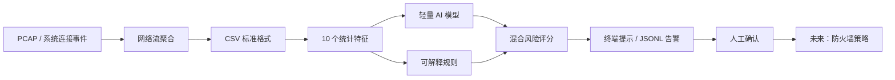

# AI Firewall（AI 防火墙）

[](https://github.com/heartofiron-dev/ai-firewall/actions/workflows/tests.yml)

一个在本机运行的、以隐私优先为原则的 AI 网络入侵检测原型。项目把可解释的安全规则与轻量统计模型结合，对网络流元数据进行风险评分，并输出结构化告警。

> **当前定位：检测与研究，不是生产级防火墙。** v0.4 默认只分析和告警，不修改 Windows 防火墙，也不自动封禁 IP。这样可以先测量误报率，再逐步开放拦截能力。

## 已经完成了什么

- 建立了从 CSV 网络流记录到风险告警的完整 MVP 流程。
- 实现 10 个基础流量特征，包括连接频率、失败次数、端口数量、SYN/RST 比例与传输字节数。
- 实现端口扫描、认证爆破、连接洪泛、异常数据突增、可疑端口 5 类可解释规则。
- 内置一个轻量线性风险模型，并使用“70% 模型 + 30% 规则、强规则保底”的混合打分方式。
- 实现不依赖第三方机器学习包的逻辑回归训练器，可使用自己的带标签 CSV 重新训练。
- 实现 precision、recall、false positive rate 等评估指标。
- 提供安全的模拟数据、自动化测试和 GitHub Actions 持续集成。
- 所有分析默认在本机完成，不上传网络记录。
- 支持直接读取 classic PCAP，将 Ethernet、RAW 或 Linux SLL 中的 IPv4/IPv6 TCP/UDP 包聚合成网络流。
- 支持 Windows 实时 TCP 连接监控，展示进程、PID、连接方向、状态、风险和告警原因。
- 支持 PCAPNG Section、Interface 与 Enhanced Packet Block，可读取多接口及各自时间分辨率。
- 默认把正反方向数据包合并为一条双向流，分别统计 `bytes_sent` 与 `bytes_received`。
- 支持使用 Windows 自带 `pktmon` 进行 1～3600 秒的限时包级采集，并转换为本地 PCAPNG。
- 支持按时间切分校准集与独立测试集，校准目标误报率，并输出逐日误报基线报告。

## 系统如何工作



当前仓库已经实现图中的 classic PCAP/PCAPNG、双向网络流聚合、Windows 连接与包级采集、CSV、特征、模型、规则、评分、提示和 JSONL 输出。IPv6 扩展头、长期后台服务、图形界面与防火墙策略属于后续阶段。

## 当前能识别的行为

| 行为 | 主要信号 | 规则编号 |
|---|---|---|
| 端口扫描 | 60 秒内访问大量不同端口 | `PORT_SCAN` |
| SSH/RDP 等爆破 | 认证端口连续连接失败 | `BRUTE_FORCE` |
| SYN/连接洪泛 | 短时间大量连接或 SYN | `CONNECTION_FLOOD` |
| 异常数据传输 | 短时间传输超过基线的数据 | `DATA_SPIKE` |
| 可疑端口通信 | 常见后门/恶意工具端口 | `SUSPICIOUS_PORT` |
| 未知统计异常 | 模型判断特征偏离正常模式 | 模型告警 |

## 快速开始

要求：Python 3.10 或更高版本。运行核心功能不需要下载第三方依赖。

```bash
git clone https://github.com/heartofiron-dev/ai-firewall.git
cd ai-firewall
python -m venv .venv
```

Windows PowerShell：

```powershell
.venv\Scripts\Activate.ps1
python -m pip install -e .
ai-firewall demo
```

macOS / Linux：

```bash
source .venv/bin/activate
python -m pip install -e .
ai-firewall demo
```

演示会分析 2 条正常样本和 4 条攻击模拟样本。它只读取仓库内的 CSV，不发送攻击流量，也不会修改系统配置。

## 功能使用方法

### 0. 从 PCAP 转换并检测

只做格式转换：

```bash
ai-firewall pcap capture.pcapng --output flows.csv
```

转换后立即检测并输出告警：

```bash
ai-firewall pcap capture.pcapng --output flows.csv --analyze --alerts pcap-alerts.jsonl
```

当前转换器具有以下边界：

- 自动识别 classic PCAP 与 PCAPNG；
- PCAPNG 支持多个 Section、Interface、Enhanced Packet Block 和接口时间分辨率；
- 支持 Ethernet、RAW IP、Linux cooked capture v1；
- 支持 IPv4 TCP/UDP，以及不带扩展头的 IPv6 TCP/UDP；
- 只使用包头和长度，不保存应用层载荷；
- 默认按双向五元组聚合，以捕获到的第一个包作为发起方向并分别统计上下行字节；
- 如需保留原始方向性流，可添加 `--directional`。

只应分析你有权查看的抓包文件。真实 PCAP 仍可能包含 IP、域名和其他敏感信息，禁止直接提交到公开仓库。

### 0.1 Windows 实时连接监控

监控 60 秒：

```powershell
ai-firewall monitor --duration 60 --output live-alerts.jsonl
```

只采集一次当前连接，适合快速验收：

```powershell
ai-firewall monitor --once --all --output current-connections.jsonl
```

持续运行直到按下 `Ctrl+C`：

```powershell
ai-firewall monitor --duration 0
```

实时监控优先通过 Windows 自带的 `Get-NetTCPConnection` 获取本机 TCP 元数据；如果当前会话无权调用它，会自动回退到只读的 `netstat -ano`。程序在系统允许时使用进程列表补充名称和 PID，通常不需要管理员权限。它只会把“本轮新出现”的连接计入按来源 IP、进程和方向隔离的 60 秒窗口，避免长连接重复计数，也避免不同桌面程序共同触发端口扫描误报。

连接表不包含完整包数和字节数，也可能错过非常短的连接，所以实时模式目前适合发现连接突增、可疑端口和进程外联，不应声称可以替代包级 IDS。需要包级分析时使用 PCAP 路线。

### 0.2 Windows 限时包级采集

在“以管理员身份运行”的 PowerShell 中执行：

```powershell
ai-firewall capture --duration 30 --output capture.pcapng
```

采集结束后立即聚合并检测：

```powershell
ai-firewall capture --duration 30 --output capture.pcapng --analyze
```

安全设计：

- 使用 Windows 自带 `pktmon`，不安装内核驱动或第三方抓包程序；
- 必须指定 1～3600 秒范围内的时长，默认 30 秒；
- 输出必须是 `.pcapng`，已存在的文件默认拒绝覆盖；
- 只有显式添加 `--overwrite` 才允许覆盖同名输出；
- 中断时仍会停止本次采集，并清理中间 ETL 文件；
- 数据只保存在指定本地路径，不会被程序上传。

PCAPNG 可能包含敏感 IP、DNS 和未加密应用数据。只在获授权的设备和网络上使用，采集后按敏感数据管理，不要提交到公开 GitHub 仓库。

### 1. 分析网络流文件

```bash
ai-firewall analyze data/sample_flows.csv --output alerts.jsonl
```

默认只把超过阈值的结果写入 `alerts.jsonl`。需要保存全部结果时：

```bash
ai-firewall analyze data/sample_flows.csv --all --output all-results.jsonl
```

可以调节告警阈值（数值越低越敏感，误报也可能越多）：

```bash
ai-firewall analyze data/sample_flows.csv --threshold 0.70
```

### 2. 训练自己的模型

训练 CSV 必须包含 `label` 列；正常样本可写 `benign` 或 `0`，攻击样本可写 `attack` 或 `1`。

```bash
ai-firewall train data/sample_flows.csv --output models/trained-model.json
```

使用新模型分析：

```bash
ai-firewall analyze data/sample_flows.csv --model models/trained-model.json
```

训练器目前是标准化后的二分类逻辑回归，使用随机梯度下降。它的优点是部署小、输出稳定、容易解释；后续可增加 LightGBM/XGBoost 适配器，但不应为了“深度学习”标签牺牲误报表现。

### 3. 评估检测效果

```bash
ai-firewall evaluate data/sample_flows.csv --model models/baseline.json
```

评估会输出：

- `precision`：告警中真正是攻击的比例；
- `recall`：真实攻击中被发现的比例；
- `false_positive_rate`：正常流量被误报的比例；
- TP、FP、TN、FN 混淆矩阵计数。

示例数据只用于验证程序流程，不能证明模型在真实网络上的效果。正式结论必须使用独立测试集，并按设备、网络环境和时间进行划分，避免数据泄漏。

### 4. 建立误报基线

对一份按时间持续收集、已经完成脱敏和标签审核的 CSV 运行：

```bash
ai-firewall benchmark labeled-flows.csv \
  --calibration-fraction 0.4 \
  --target-fpr 0.01 \
  --output benchmark-report.json
```

该命令不会随机打乱数据。最早的 40% 记录只用于选择满足目标 FPR 的阈值，后续 60% 作为独立测试时间段，报告：

- 校准阈值及目标是否达到；
- 独立测试集 Precision、Recall、FPR 与混淆矩阵；
- 平均每日误报数量；
- 每个 UTC 日期的正常/攻击样本数、误报数和当日 FPR；
- 数据过少或目标无法满足时的明确警告。

至少需要 8 条记录；校准期必须包含正常样本，独立测试期必须同时包含正常和攻击样本。少于 1000 条测试记录或 1000 条正常测试记录时，报告会标记置信度不足。建议真实发布门槛至少使用跨多个工作日、从未参与训练的数据。

不要使用 `data/sample_flows.csv` 宣称真实性能：它是程序演示集，规模不足，`benchmark` 会拒绝它。

## CSV 数据格式

| 字段 | 类型 | 含义 |
|---|---:|---|
| `timestamp` | string | ISO 8601 时间 |
| `src_ip`, `dst_ip` | string | 源与目标 IP |
| `src_port`, `dst_port` | int | 源与目标端口 |
| `protocol` | string | TCP / UDP 等 |
| `duration_ms` | number | 连接时长（毫秒） |
| `packets` | int | 数据包总数 |
| `bytes_sent`, `bytes_received` | int | 上下行字节数 |
| `syn_count`, `rst_count` | int | TCP SYN / RST 数量 |
| `unique_dst_ports_60s` | int | 同一来源 60 秒内访问的不同目标端口数 |
| `connections_60s` | int | 同一来源 60 秒内连接数 |
| `failed_connections_60s` | int | 同一来源 60 秒内失败连接数 |
| `label` | string | 可选；训练/评估时必需 |

本项目只需要连接元数据，不需要读取 HTTPS 内容。实际采集时仍应移除或哈希不必要的标识符，并遵守所在地法律、组织政策和用户授权范围。

## 怎么测试

### 一键运行全部自动化测试

```bash
python -m unittest discover -s tests -v
```

当前测试覆盖：

- 正常 HTTPS 与 DNS 样本不告警；
- 端口扫描能告警并返回对应解释；
- SSH/RDP 爆破能被识别；
- 连接洪泛会得到最高严重级别；
- 异常大流量与可疑端口能同时留下证据；
- 训练结果能保存、重新加载并给出 0～1 概率。
- 合成 classic PCAP 能正确解析 TCP 五元组并计算 60 秒上下文；损坏文件会被拒绝。
- Windows PowerShell JSON 能转换为连接对象，入站/出站方向推断和长连接去重有效。
- PCAPNG 的 Section、Interface、微秒时间分辨率与 Enhanced Packet Block 能正确解析。
- TCP 正反方向数据包能合并，并分别累计上下行字节；`--directional` 仍可保留两条流。
- Windows 包级采集会拒绝无限时长、错误扩展名和意外覆盖，并生成明确的 `pktmon` 命令。
- 误报基线会按时间切分，输出逐日 FPR，并拒绝过小或类别缺失的独立测试区间。

### 手工验收清单

1. 执行 `ai-firewall demo`，应看到 6 条分析结果，其中 2 条为 `OK`、4 条为 `ALERT`。
2. 执行 `ai-firewall analyze data/sample_flows.csv`，确认生成 `alerts.jsonl`。
3. 检查每条告警是否有 `risk_score`、`severity`、`reasons` 和 `rule_ids`。
4. 执行训练命令，确认新模型 JSON 中包含训练时间、样本数和算法信息。
5. 执行评估命令，确认 precision、recall 与误报率均有输出。
6. 向 CSV 删除一个必需字段，程序应清楚提示缺少字段，而不是静默跳过。

### 真实环境测试原则

- 先用自己有权限的实验网络或虚拟机；不要扫描公共 IP 或未经授权的设备。
- 第一轮保持“只告警”，至少收集一至两周正常基线。
- 将训练集、验证集、测试集按时间分割；同一会话不能跨集合。
- 逐类记录漏报，尤其是低速扫描、慢速爆破与加密恶意通信。
- 把每日误报数量作为发布门槛，而不只看总体 accuracy。
- 自动拦截功能上线前必须具备允许名单、超时解封、审计日志和紧急关闭开关。

## 项目结构

```text
ai-firewall/
├── data/sample_flows.csv       # 不会产生真实攻击的演示数据
├── models/baseline.json        # 开发用启动模型
├── src/ai_firewall/
│   ├── cli.py                  # demo/analyze/train/evaluate 命令
│   ├── benchmark.py            # 时间切分、阈值校准与逐日误报报告
│   ├── detector.py             # 混合评分与告警结果
│   ├── features.py             # 特征提取
│   ├── io.py                   # CSV 与 JSONL 输入输出
│   ├── model.py                # 模型加载和推理
│   ├── pcap.py                 # 纯 Python classic PCAP 解析与流聚合
│   ├── rules.py                # 可解释安全规则
│   ├── schema.py               # 网络流数据结构
│   ├── training.py             # 逻辑回归训练器
│   ├── windows_capture.py      # pktmon 限时采集、ETL 转 PCAPNG
│   └── windows_monitor.py      # Windows 连接、进程和滚动窗口监控
├── tests/                      # 自动化测试
├── .github/workflows/tests.yml # GitHub Actions
├── SECURITY.md                 # 安全与漏洞报告说明
└── README.md
```

## 数据与模型计划

建议按下面的顺序引入数据，而不是直接混合所有公开数据集：

1. 使用 `sample_flows.csv` 验证代码、格式和测试闭环。
2. 编写 CICIDS2017 / CSE-CIC-IDS2018 / UNSW-NB15 的独立转换器，统一到本项目字段。
3. 在隔离实验室中生成少量、可复现且有明确授权的攻击样本。
4. 收集经过匿名化的真实正常流量，建立不同设备类型和使用时段的基线。
5. 保留从未参与训练的时间段与网络作为最终测试集。
6. 记录数据来源、许可、采集日期、标签方式、脱敏方式与已知偏差。

公开数据集的标签和流量分布可能与个人电脑差异很大，因此模型不能只在公开数据集上得到高分就直接用于拦截。

## 作业事项 / Roadmap

| 优先级 | 事项 | 验收标准 | 状态 |
|---|---|---|---|
| P0 | 完成离线检测闭环 | CSV → 特征 → 模型/规则 → JSONL 告警 | ✅ v0.1 |
| P0 | 建立自动化测试 | Python 3.10/3.12 在 GitHub Actions 通过 | ✅ v0.1 |
| P0 | 误报基线工具 | 时间切分、阈值校准、独立测试集每日误报与 FPR 报告 | ✅ v0.4 |
| P0 | 真实环境误报基线 | 在获授权且脱敏的跨日独立数据上达到发布门槛 | 待数据 |
| P1 | PCAP 转换器 | 可将授权的 classic PCAP 聚合成本项目 CSV，不保存载荷 | ✅ v0.2 |
| P1 | Windows 实时采集 | 低权限优先；展示进程、目的地和连接统计 | ✅ v0.2 基础版 |
| P1 | PCAPNG 与双向流 | 支持多接口 PCAPNG 与双向字节统计 | ✅ v0.3 |
| P1 | Windows 包级采集 | 使用 pktmon 限时采集、转 PCAPNG 并可直接检测 | ✅ v0.3 |
| P1 | IPv6 扩展头 | 安全遍历常见扩展头并限制解析深度 | 待办 |
| P1 | 数据集转换器 | CICIDS、UNSW-NB15 分别有转换脚本与字段测试 | 待办 |
| P1 | 模型对比 | 逻辑回归、Isolation Forest、LightGBM 使用同一时间切分评估 | 待办 |
| P1 | 可解释性 | 每条告警显示主要特征、规则证据和模型版本 | 部分完成 |
| P2 | 本地界面 | 查看实时连接、筛选告警、标记误报 | 待办 |
| P2 | 反馈学习 | 用户反馈进入隔离队列，经审核后再训练 | 待办 |
| P2 | Windows 防火墙集成 | 默认关闭；允许名单、临时封禁、回滚和 kill switch 齐全 | 待办 |
| P2 | 模型签名与更新 | 更新包签名、版本固定、失败自动回滚 | 待办 |
| P2 | 性能测试 | 目标设备 CPU/内存/延迟有可复现实验报告 | 待办 |

### 每次发布前的维护事项

- 更新模型卡：训练数据、时间范围、指标、已知偏差、适用和禁用场景。
- 运行单元测试、演示、数据格式校验与独立测试集评估。
- 检查依赖漏洞、许可证与敏感信息；禁止提交真实个人网络日志。
- 抽查最高风险告警的解释；记录阈值变化及原因。
- 验证旧模型和旧 CSV 的兼容性，或提供明确迁移说明。
- 更新 README 的功能状态、测试结果和 Roadmap。

## 安全边界

- 本项目不包含漏洞利用代码，也不需要主动攻击其他设备。
- 仅在你拥有或明确获准测试的网络上采集与验证。
- `baseline.json` 是开发启动模型，不代表已经过真实环境验证。
- 不要把密码、Cookie、API key、原始私密流量或个人身份信息提交到仓库。
- AI 结论必须经过规则、上下文和人工复核；当前版本不可作为唯一拦截依据。

## 贡献

欢迎通过 Issue 提交数据格式、误报案例、PCAP 转换器和跨平台采集建议。提交样本时只能使用合成数据或已获得分享授权并完成脱敏的数据。

## License

MIT License。详见 [LICENSE](LICENSE)。
